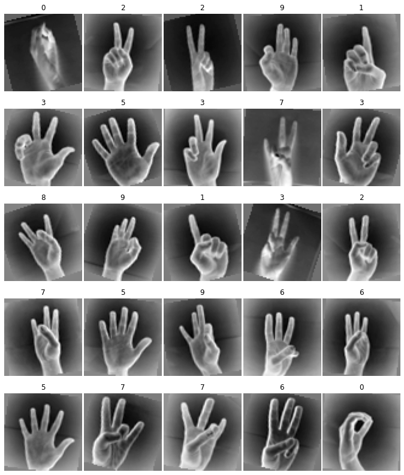
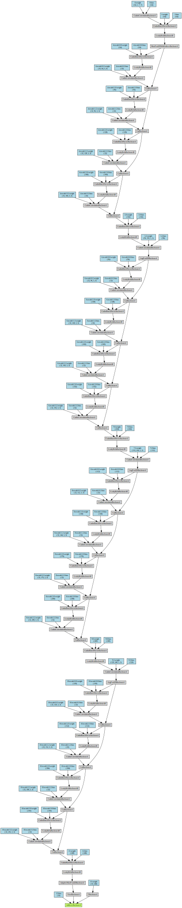
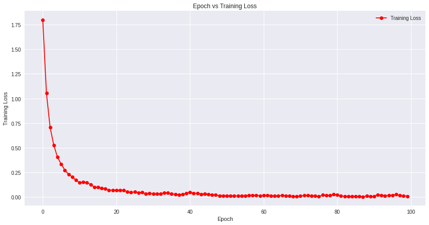
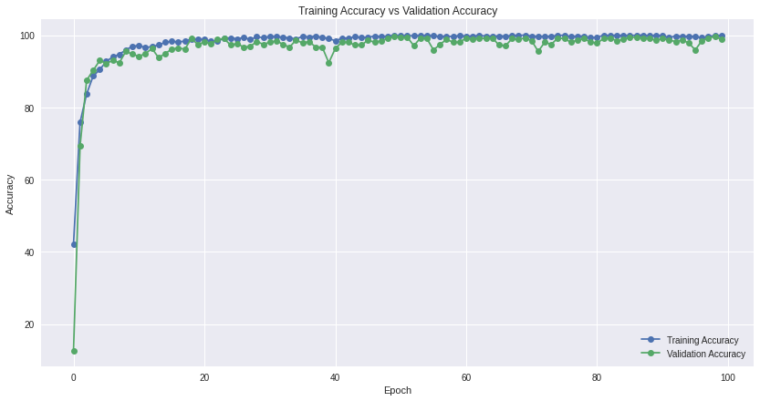
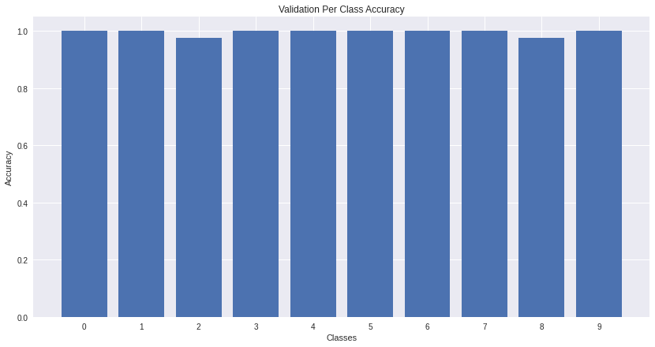
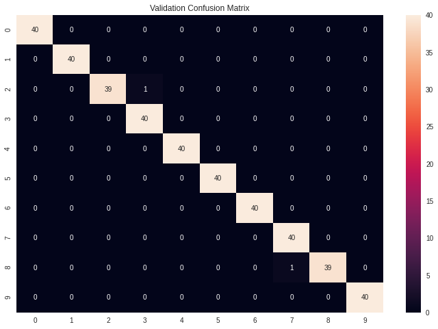

# Machine-Learning-Hackathon

## The problem statement

Public surfaces are a possible way for the transmission of COVID-19. NIT Warangal
administration has decided to minimize the spread of COVID-19 to ensure the safety of its
residents. Elevator switches are public surfaces. So the admin wants to implement a deep
learning model for elevators on the campus. The goal is to determine the destination floor
of a person standing inside the elevator using hand signs. Accuracy of the model should be
at least 90%.

## The dataset

- [Original dataset](https://github.com/ardamavi/Sign-Language-Digits-Dataset)
    - 10 classes, for 10 unique hand signs.
	- Image size: 100x100
	- Color space: RGB

- Applied data preprocessing
    - Reshaped to 64x64
    - From RGB to 1 channel grayscale
    - Normalization range: -1 to 1

- Applied data augmentation
    1. Random horizontal flip (as the hand could be right or left)
    2. -20 to 20 degrees random rotation with bicubic resample
    3. Filling with 0.85 * mean of the image (to prevent strong dark background after the random rotation)

- Training and Validation data split
	- About 20% of the data is used for validation.
	- For each class in validation, there's total 40 images.
	- So in total I've used 400 images for validation.
	- And the remaining 1,662 images for training.

- Training data after preprocessing and augmentation



## The model architecture

- I've followed simple DenseNet architecture, and replaced ReLU to LeakyReLU with alpha of 0.2

- Here's the model summary:

```
----------------------------------------------------------------
        Layer (type)               Output Shape         Param #
================================================================
            Conv2d-1           [-1, 64, 32, 32]           3,200
       BatchNorm2d-2           [-1, 64, 32, 32]             128
         LeakyReLU-3           [-1, 64, 32, 32]               0
         MaxPool2d-4           [-1, 64, 16, 16]               0
       BatchNorm2d-5           [-1, 64, 16, 16]             128
         LeakyReLU-6           [-1, 64, 16, 16]               0
            Conv2d-7           [-1, 32, 16, 16]          18,464
       BatchNorm2d-8           [-1, 96, 16, 16]             192
         LeakyReLU-9           [-1, 96, 16, 16]               0
           Conv2d-10           [-1, 32, 16, 16]          27,680
      BatchNorm2d-11          [-1, 128, 16, 16]             256
        LeakyReLU-12          [-1, 128, 16, 16]               0
           Conv2d-13           [-1, 32, 16, 16]          36,896
      BatchNorm2d-14          [-1, 160, 16, 16]             320
        LeakyReLU-15          [-1, 160, 16, 16]               0
           Conv2d-16           [-1, 32, 16, 16]          46,112
       DenseBlock-17          [-1, 192, 16, 16]               0
      BatchNorm2d-18          [-1, 192, 16, 16]             384
        LeakyReLU-19          [-1, 192, 16, 16]               0
           Conv2d-20           [-1, 96, 16, 16]          18,528
        AvgPool2d-21             [-1, 96, 8, 8]               0
      BatchNorm2d-22             [-1, 96, 8, 8]             192
        LeakyReLU-23             [-1, 96, 8, 8]               0
           Conv2d-24             [-1, 32, 8, 8]          27,680
      BatchNorm2d-25            [-1, 128, 8, 8]             256
        LeakyReLU-26            [-1, 128, 8, 8]               0
           Conv2d-27             [-1, 32, 8, 8]          36,896
      BatchNorm2d-28            [-1, 160, 8, 8]             320
        LeakyReLU-29            [-1, 160, 8, 8]               0
           Conv2d-30             [-1, 32, 8, 8]          46,112
      BatchNorm2d-31            [-1, 192, 8, 8]             384
        LeakyReLU-32            [-1, 192, 8, 8]               0
           Conv2d-33             [-1, 32, 8, 8]          55,328
       DenseBlock-34            [-1, 224, 8, 8]               0
      BatchNorm2d-35            [-1, 224, 8, 8]             448
        LeakyReLU-36            [-1, 224, 8, 8]               0
           Conv2d-37            [-1, 112, 8, 8]          25,200
        AvgPool2d-38            [-1, 112, 4, 4]               0
      BatchNorm2d-39            [-1, 112, 4, 4]             224
        LeakyReLU-40            [-1, 112, 4, 4]               0
           Conv2d-41             [-1, 32, 4, 4]          32,288
      BatchNorm2d-42            [-1, 144, 4, 4]             288
        LeakyReLU-43            [-1, 144, 4, 4]               0
           Conv2d-44             [-1, 32, 4, 4]          41,504
      BatchNorm2d-45            [-1, 176, 4, 4]             352
        LeakyReLU-46            [-1, 176, 4, 4]               0
           Conv2d-47             [-1, 32, 4, 4]          50,720
      BatchNorm2d-48            [-1, 208, 4, 4]             416
        LeakyReLU-49            [-1, 208, 4, 4]               0
           Conv2d-50             [-1, 32, 4, 4]          59,936
       DenseBlock-51            [-1, 240, 4, 4]               0
      BatchNorm2d-52            [-1, 240, 4, 4]             480
        LeakyReLU-53            [-1, 240, 4, 4]               0
           Conv2d-54            [-1, 120, 4, 4]          28,920
        AvgPool2d-55            [-1, 120, 2, 2]               0
      BatchNorm2d-56            [-1, 120, 2, 2]             240
        LeakyReLU-57            [-1, 120, 2, 2]               0
           Conv2d-58             [-1, 32, 2, 2]          34,592
      BatchNorm2d-59            [-1, 152, 2, 2]             304
        LeakyReLU-60            [-1, 152, 2, 2]               0
           Conv2d-61             [-1, 32, 2, 2]          43,808
      BatchNorm2d-62            [-1, 184, 2, 2]             368
        LeakyReLU-63            [-1, 184, 2, 2]               0
           Conv2d-64             [-1, 32, 2, 2]          53,024
      BatchNorm2d-65            [-1, 216, 2, 2]             432
        LeakyReLU-66            [-1, 216, 2, 2]               0
           Conv2d-67             [-1, 32, 2, 2]          62,240
       DenseBlock-68            [-1, 248, 2, 2]               0
      BatchNorm2d-69            [-1, 248, 2, 2]             496
        LeakyReLU-70            [-1, 248, 2, 2]               0
AdaptiveMaxPool2d-71            [-1, 248, 1, 1]               0
          Flatten-72                  [-1, 248]               0
           Linear-73                   [-1, 10]           2,490
================================================================
Total params: 758,226
Trainable params: 758,226
Non-trainable params: 0
----------------------------------------------------------------
Input size (MB): 0.02
Forward/backward pass size (MB): 6.36
Params size (MB): 2.89
Estimated Total Size (MB): 9.26
----------------------------------------------------------------
```

- And here's the model visualization:



## Requirements for running training and testing script

1. Pytorch:
    - `pip install torch==1.5.1+cu101 torchvision==0.6.1+cu101 -f https://download.pytorch.org/whl/torch_stable.html`
    - Replace `cu101` with your cuda version.

2. Pytorch Summary:
    `pip install torchsummary`

3. TQDM:
    `pip install tqdm`

4. Pillow:
    `pip install Pillow`


## [Training Results](training.ipynb)

- Training Accuracy   : 99.819712
- Validation Accuracy : 99.609375
- Validation F1 Score : 0.9939696

- Training Loss vs Epoch :-


- Training Accuracy vs Validation Accuracy :-


- Per Class Accuracy for Validation:-


- Confusion Matrix for Validation:-


So in validation (out of 400 images), only two images are predicted incorrectly, impressive!

## [Testing the model](testing.ipynb)

Replace the `test_root` variable value to the test data directory.

# Author - __Rishik Mourya__